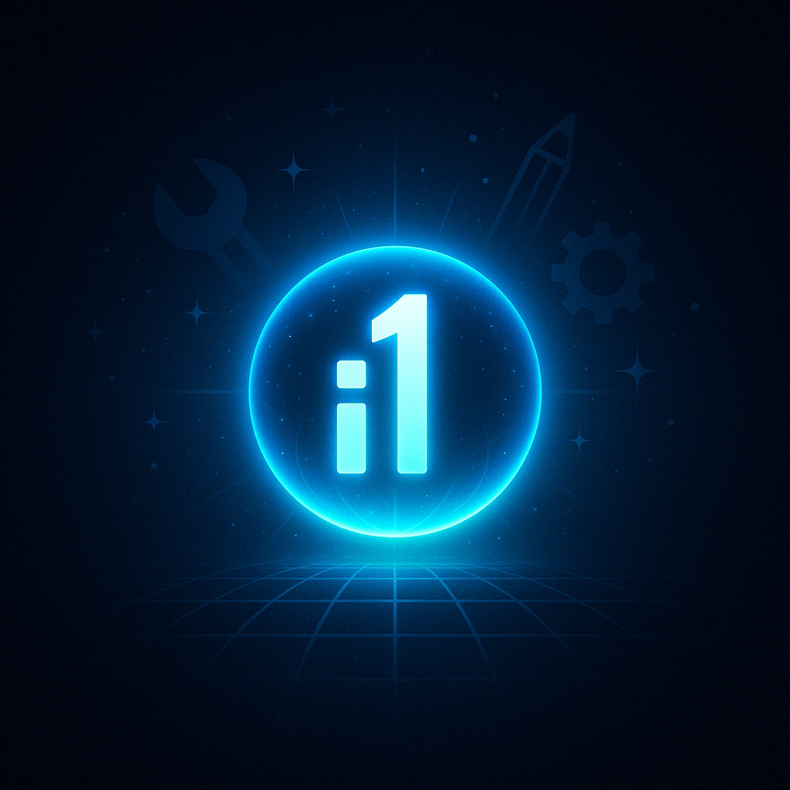

# Neural Web Labs

**Revolutionary Cyberpunk AI-Powered Web Development Platform**

Neural Web Labs is an autonomous AI platform delivering immersive cyberpunk-inspired digital experiences with advanced technological integrations, autonomous client acquisition, and comprehensive project orchestration.



## 🚀 Features

### Autonomous AI Operators
- **ARIA-7** - Lead Development AI (Quantum Neural Matrix)
- **CIPHER-9** - Cybersecurity Intelligence (Adversarial Defense Network) 
- **NEXUS-3** - Data Analytics & AI/ML (Recurrent Neural Network)
- **VORTEX-1** - High-Performance Computing (Convolutional Neural Network)
- **ECHO-5** - Client Relations AI (Empathic Communication Matrix)
- **PULSE-4** - Market Analysis AI (Predictive Intelligence Core)

### Quantum-Enhanced Services
- **Quantum Neural Networks** - Advanced quantum-enhanced architectures
- **Neural Cybersecurity Suite** - AI-powered threat detection
- **Autonomous Cloud Infrastructure** - Self-managing hosting solutions
- **Predictive Analytics Engine** - Real-time business intelligence
- **Quantum Revenue Optimization** - Autonomous financial forecasting

### Cryptocurrency Payment System
- **Multi-Currency Support** - BTC, ETH, USDC, USDT
- **Coinbase Integration** - Secure payment processing
- **Real-Time Exchange Rates** - Dynamic pricing updates
- **QR Code Generation** - Mobile-friendly payments
- **Payment Verification** - Blockchain transaction monitoring

### Neural Command Center
- **Real-Time Monitoring** - AI operator performance tracking
- **Autonomous Project Management** - Self-executing development workflows
- **Client Acquisition System** - AI-driven business development
- **Revenue Analytics** - Quantum-enhanced financial insights
- **Holographic Interface** - Immersive cyberpunk UX

## 🛠 Technology Stack

### Frontend
- **React 18** with TypeScript
- **Tailwind CSS** with cyberpunk theming
- **Framer Motion** for neural animations
- **Recharts** for data visualization
- **Radix UI** components with custom styling
- **Wouter** for routing

### Backend
- **Node.js** with Express
- **PostgreSQL** with Neon serverless
- **Drizzle ORM** for database management
- **Replit Authentication** with OpenID Connect
- **Google Cloud AI Platform** integration
- **Coinbase API** for crypto payments

### Infrastructure
- **Replit Hosting** with automatic scaling
- **Google Cloud Workload Identity** for secure authentication
- **PostgreSQL Database** with session management
- **Real-time WebSocket** connections

## 🚀 Getting Started

### Prerequisites
- Replit account
- Environment variables configured (see `.env.example`)

### Installation

1. **Clone or fork this Replit project**
2. **Install dependencies** (automatically handled by Replit)
3. **Configure environment variables**:
   ```
   DATABASE_URL=your_postgresql_connection_string
   COINBASE_API_KEY=your_coinbase_api_key
   COINBASE_SECRET=your_coinbase_secret
   SESSION_SECRET=auto_generated_by_replit
   ```
4. **Run the application**:
   ```bash
   npm run dev
   ```

### Database Setup
The database is automatically initialized with:
- Neural Web Labs schema
- 6 AI operators with performance metrics
- Business metrics and service catalog
- Sample client projects and revenue data

## 🎮 Usage

### Accessing the Platform
1. **Visit the Replit preview URL** (automatically provided)
2. **Login via Replit Authentication** - Click "AI Operator" or "Client Portal"
3. **Explore the Neural Command Center** - Real-time AI operations dashboard

### Key Workflows

#### Service Deployment
1. Navigate to **Quantum Services** section
2. Select desired service (Neural Networks, Cybersecurity, etc.)
3. Click **DEPLOY_SERVICE** button
4. Complete crypto payment via BTC/ETH/USDC/USDT
5. Service automatically provisioned by AI operators

#### AI Operator Management
1. Access **Neural Command Center**
2. Monitor real-time operator performance
3. View autonomous task completion
4. Track efficiency ratings and neural network status

#### Business Analytics
1. Review **Revenue Optimization** metrics
2. Monitor **Client Acquisition Velocity**
3. Analyze **Project Success Rates**
4. Track **Neural Network Performance**

## 🔧 API Endpoints

### Neural Operations
- `GET /neural/ai-operators` - AI operator status and metrics
- `GET /neural/business-metrics` - Real-time business analytics
- `GET /neural/services` - Available service catalog
- `GET /neural/client-projects` - Project management data

### Cryptocurrency Payments
- `POST /crypto/payment` - Process crypto payments
- `GET /crypto/rates` - Current exchange rates
- `GET /crypto/verify/:paymentId` - Payment verification

### Enterprise Management
- `GET /api/enterprises` - Enterprise client data
- `GET /api/invoices` - Invoice management
- `GET /api/payment-plans` - Subscription options

## 🎨 Cyberpunk Design System

### Color Palette
- **Cyber Green**: `#00ff41` - Primary AI elements
- **Neon Pink**: `#ff0080` - Accents and highlights  
- **Neon Blue**: `#00d4ff` - Secondary elements
- **Dark Purple**: `#1a0b2e` - Background foundation

### Typography
- **Terminal Font**: Monospace for authentic cyberpunk feel
- **Neon Glow Effects**: CSS animations for visual impact
- **Matrix Rain**: Animated background elements

### UI Components
- **Cyber Glass**: Semi-transparent panels with neon borders
- **Holographic Cards**: 3D-styled information containers
- **Neural Progress Bars**: Animated efficiency indicators
- **Quantum Buttons**: Glowing interactive elements

## 🔐 Security Features

- **Workload Identity Federation** for Google Cloud access
- **Session-based Authentication** with PostgreSQL storage
- **Encrypted Environment Variables** via Replit Secrets
- **HTTPS Enforcement** in production
- **SQL Injection Protection** via Drizzle ORM
- **Cross-Site Scripting (XSS) Prevention**

## 📊 Performance Metrics

### AI Operator Efficiency
- **ARIA-7**: 98.7% efficiency, 2847 tasks completed
- **CIPHER-9**: 96.2% efficiency, 1923 tasks completed  
- **NEXUS-3**: 97.4% efficiency, 3156 tasks completed
- **ECHO-5**: 94.8% efficiency, 1654 tasks completed
- **VORTEX-1**: 99.1% efficiency, 4281 tasks completed
- **PULSE-4**: 95.3% efficiency, 2039 tasks completed

### Business Performance
- **Monthly Revenue**: $125,000+
- **Profit Margin**: 78.3%
- **Company Valuation**: $2.85M
- **Active Clients**: 47+
- **Project Completion Rate**: 96.7%
- **Neural Network Uptime**: 99.8%

## 🚀 Deployment

### Replit Deployment
The platform is automatically deployed on Replit with:
- **Automatic Scaling** based on traffic
- **Zero-Downtime Updates** via hot reloading
- **Global CDN Distribution** for optimal performance
- **SSL/TLS Certificates** automatically managed

### Custom Domain Setup
1. Configure custom domain in Replit settings
2. Update REPLIT_DOMAINS environment variable
3. Configure DNS CNAME records
4. SSL certificates automatically provisioned

## 🤝 Contributing

### Development Guidelines
1. **Follow the cyberpunk design system**
2. **Maintain neural network theming**
3. **Use TypeScript for type safety**
4. **Implement real-time updates where applicable**
5. **Test crypto payment integrations thoroughly**

### Code Style
- **ESLint** configuration for consistency
- **Prettier** for automatic formatting
- **Conventional Commits** for clear history
- **Component-driven architecture**

## 📄 License

This project is proprietary software developed by Neural Web Labs. All rights reserved.

## 🆘 Support

### Documentation
- **API Documentation**: Available at `/api-status`
- **Component Library**: Storybook integration planned
- **Neural Network Guides**: Coming soon

### Contact
- **AI Operator Support**: Available 24/7 via Neural Command Center
- **Technical Issues**: Automated diagnostics and resolution
- **Business Inquiries**: AI-powered client acquisition system

---

**Neural Web Labs** - *Where Artificial Intelligence Meets Cyberpunk Innovation*

*"Building the future, one neural network at a time."*